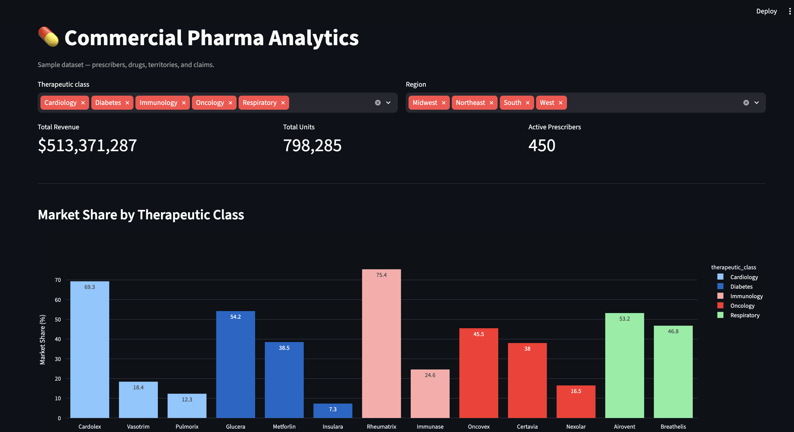
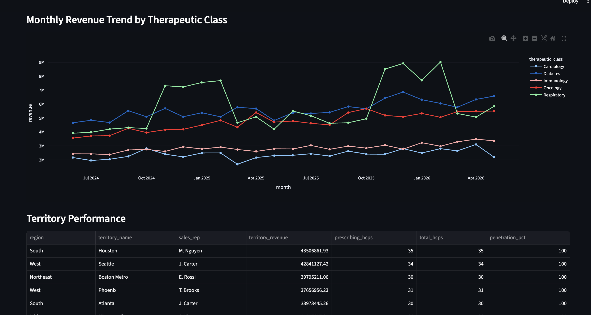
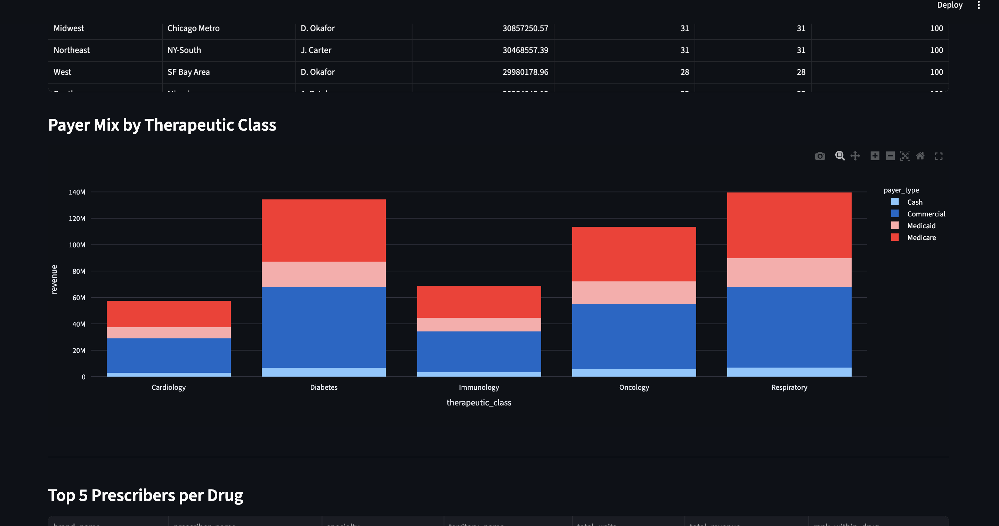

# Commercial Pharma Analytics Dashboard

A SQL/Python dashboard for analyzing pharma commercial data — market share by
therapeutic class, sales territory performance, payer mix, and top-prescriber
rankings.

**Stack:** SQLite (portable, works the same on Postgres) · Python · Streamlit · Plotly

## Screenshots

**Overview + market share by therapeutic class**


**Revenue trend over time + territory performance table**


**Payer mix + top prescribers per drug**


## Data model

Four tables:

- **territories** — sales territory, region, assigned rep
- **drugs** — brand/generic name, therapeutic class, manufacturer, list price, launch year
- **prescribers** — doctors, with specialty and territory assignment
- **claims** — one row per prescription claim: drug, prescriber, date, payer type, quantity, cost

Schema is close to the shape of CMS's public **Medicare Part D Prescriber**
files, so it's a light transform to point this at real CMS data instead of
the generated sample.

## Setup

```bash
cd sql
python3 generate_data.py

cd ../app
pip install -r ../requirements.txt
streamlit run app.py
```

Runs at `http://localhost:8501`. Filters at the top (therapeutic class,
region) recompute everything below live.

## Project structure

```
pharma-analytics/
├── sql/
│   ├── schema.sql
│   ├── generate_data.py
│   ├── queries.sql
│   └── queries_sqlite_compat.sql
├── app/
│   └── app.py
├── data/
│   └── pharma_analytics.db
├── screenshots/
└── requirements.txt
```

## Notes

- The sample dataset is synthetically generated (`generate_data.py`) with
  seasonal and growth patterns baked in so the trends look realistic.
- To use real data, download a year of CMS Medicare Part D Prescriber data
  (data.cms.gov) and map its columns onto `prescribers` / `drugs` / `claims`.
- Porting to Postgres: swap `sqlite3.connect(...)` for `psycopg2.connect(...)`
  and `strftime('%Y-%m', claim_date)` for `TO_CHAR(claim_date, 'YYYY-MM')`.
  Everything else runs unchanged.
